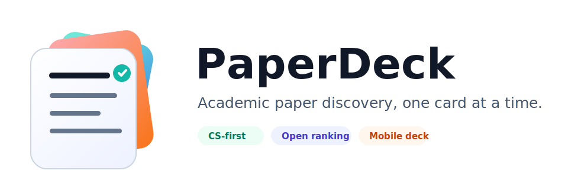

<p align="center">
  
</p>

# PaperDeck

Mobile-first academic paper discovery for computer science, with swipe-based recommendations, private reading lists, and open-source semantic ranking.

PaperDeck is a planned web app for discovering computer science papers through a social-style, full-screen card deck. Users choose academic interests, browse paper cards, open details with a swipe, save favorites, and build private reading lists.

## Project Status

PaperDeck is currently in early MVP implementation. The repository contains the Next.js app skeleton, Clerk production auth, Supabase schema, a server-side persistence layer, seeded topic/paper catalog data, route structure, and planning documents. See [ROADMAP.md](./ROADMAP.md) for the current product and technical plan.

## MVP Scope

- Google login through Clerk.
- Hierarchical computer science interest onboarding.
- Mobile-first full-screen paper deck.
- Abstract preview with expandable text.
- Swipe left to dismiss a paper.
- Swipe right to open the paper detail view.
- Heart button for favorites.
- Bookmark button for the default `Read later` playlist.
- External links to arXiv, DOI, publisher pages, or legal PDFs when available.
- In-app digest.
- Private favorites and playlists.

## Planned Data Sources

The MVP starts with arXiv and expands with additional metadata sources:

- arXiv for computer science preprints, abstracts, categories, and PDF/page links.
- Semantic Scholar for metadata, citations, and additional paper URLs.
- OpenAlex and Unpaywall for enrichment, deduplication, and open access information.
- DBLP and Crossref as later bibliographic enrichment sources.

## Recommendation Approach

PaperDeck will use a hybrid ranking strategy:

- user-selected CS interests;
- paper topics and categories;
- local open-source embeddings;
- explicit interactions such as dismiss, open detail, favorite, and save;
- penalties for papers already seen or marked as known;
- a small freshness boost;
- a capped share of classic/high-impact papers.

The first embedding model planned for the MVP is `BAAI/bge-small-en-v1.5`, with later comparison against `intfloat/e5-small-v2` and `sentence-transformers/all-MiniLM-L6-v2`.

## Planned Architecture

- Frontend/backend: Next.js with TypeScript.
- Auth: Clerk with Google login.
- Database: Supabase Postgres.
- Vector search: pgvector.
- App hosting: Vercel.
- Batch ingestion and embeddings: GitHub Actions worker, scheduled daily and runnable manually.
- Initial deployment strategy: free-first, avoiding paid AI APIs and keeping long-running work outside Vercel Functions.

## Local Environment

Create `.env.local` from `.env.example` and fill in the Clerk and Supabase keys:

```env
NEXT_PUBLIC_CLERK_PUBLISHABLE_KEY=pk_test_replace_me
CLERK_SECRET_KEY=sk_test_replace_me
NEXT_PUBLIC_CLERK_SIGN_IN_URL=/sign-in
NEXT_PUBLIC_CLERK_SIGN_UP_URL=/sign-up
NEXT_PUBLIC_CLERK_SIGN_IN_FALLBACK_REDIRECT_URL=/feed
NEXT_PUBLIC_CLERK_SIGN_UP_FALLBACK_REDIRECT_URL=/onboarding
CLERK_AUTHORIZED_PARTIES=http://localhost:3000,https://paperdeck.example.com

NEXT_PUBLIC_SUPABASE_URL=https://replace-me.supabase.co
NEXT_PUBLIC_SUPABASE_ANON_KEY=replace_me
SUPABASE_SERVICE_ROLE_KEY=replace_me_server_only
```

`.env.local` is intentionally ignored by Git.

## Database

The initial database plan lives in [docs/database.md](./docs/database.md). The SQL schema draft is in [supabase/schema.sql](./supabase/schema.sql).

The MVP stores Clerk user IDs in `owner_id` fields and routes user-specific data through trusted server code. RLS policies are included for the future Clerk JWT integration path.

Current server-side persistence covers profiles, onboarding interests, favorites, the default `Read later` playlist, playlist items, paper interactions, and a seeded starter catalog.

## Deployment

Deployment notes live in [docs/deployment.md](./docs/deployment.md). The current public URL is <https://paperdeck.michaelpiccirilli.it/>.

Protected routes require Clerk production keys on public deployments. Development keys are kept for local work.

## Repository Layout

```text
.
|-- .env.example
|-- AGENT.md
|-- CHANGELOG.md
|-- docs/
|   |-- database.md
|   `-- deployment.md
|-- README.md
|-- ROADMAP.md
|-- package.json
|-- src/
|   |-- app/
|   |-- components/
|   |-- lib/
|   |-- proxy.ts
|   `-- types/
|-- sessions/
|   `-- SESSION1.md
|-- supabase/
|   `-- schema.sql
`-- logo/
    `-- paperdeck-logo.svg
```

## Logo

The repository logo lives at [`logo/paperdeck-logo.svg`](./logo/paperdeck-logo.svg).

## Roadmap

The detailed roadmap is maintained in [ROADMAP.md](./ROADMAP.md).
