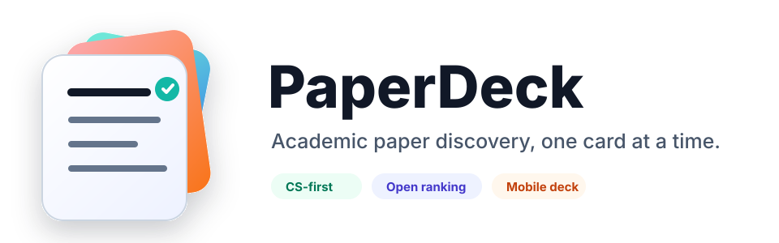

<p align="center">
  
</p>

# PaperDeck

**Not another reference manager. A daily paper deck for CS researchers.**

PaperDeck is a mobile-first paper triage deck for computer science researchers: discover, skim, and shortlist relevant papers in minutes. The app is designed around a fast daily triage loop — open the deck, swipe through cards, and walk away with a shortlist of papers worth reading.

## Project Status

PaperDeck is currently at `0.2.0`: a deployed MVP with production auth,
semantic and feedback-aware paper discovery, persistent feed batches, private
library workflows, and invite-only research groups with shared paper activity.
The app is deployed at <https://paperdeck.michaelpiccirilli.it/>. See
[docs/architecture.md](./docs/architecture.md) for the authoritative current
architecture and feature boundaries, and [ROADMAP.md](./ROADMAP.md) for durable
product decisions and next steps.

## MVP Scope

PaperDeck focuses on three things: fast discovery, quick triage, and a shortlist workflow. Every feature must make the daily 3-minute CS triage loop faster or more accurate.

**What PaperDeck does (MVP):**

- Google login through Clerk.
- Hierarchical computer science interest onboarding.
- Catalog search for PaperDeck's local CS paper collection.
- Mobile-first full-screen paper deck with swipe interactions.
- Abstract preview with expandable text and inline LaTeX rendering.
- Swipe left to dismiss a paper, swipe right to save to Read later.
- Heart button for favorites.
- Bookmark button to add/remove papers from private playlists.
- Detail actions for `Already read` and `Not interested` signals.
- External links to arXiv, DOI, publisher pages, or legal PDFs when available.
- In-app digest.
- Private favorites and playlists with drag-and-drop ordering.

**What PaperDeck does not do (post-MVP):**

- PDF chat or audio summaries.
- Full-text RAG on publisher PDFs.
- Universal search for authors, journals, or institutions.
- Full reference manager replacement.
- Public or social reading lists.

## Product principles

PaperDeck is a **daily CS triage deck**, not a generalist research suite. Every feature must answer: *"Does this help a CS researcher discover, skim, and shortlist relevant papers in under 3 minutes?"*

- **Vertical focus:** CS only for MVP.
- **Free-first:** every component works within free tiers (Vercel, Supabase, GitHub Actions). Paid services require prior approval.
- **Privacy-first:** user reading behavior stays private. No public profiles or social surfaces.
- **Content respect:** never import or republish full text unless the license clearly allows it. Always preserve LaTeX/math in abstracts.

## Planned Data Sources

The MVP starts with arXiv and expands with additional metadata sources:

- arXiv for computer science preprints, abstracts, categories, and PDF/page links.
- Semantic Scholar for metadata, citations, and additional paper URLs.
- OpenAlex and Unpaywall for enrichment, deduplication, and open access information.
- DBLP and Crossref as later bibliographic enrichment sources.

## Recommendation Approach

PaperDeck will use a hybrid ranking strategy:

- user-selected CS interests;
- paper topics and categories;
- explicit interactions such as dismiss, open detail, favorite, and save;
- penalties for papers already seen or marked as known;
- a small freshness boost;
- a capped share of classic/high-impact papers.

The current live ranking uses selected topics, topic hierarchy, recent explicit feedback, citation/year metadata, seen-paper penalties, and semantic candidates when a stored user profile vector exists. The embedding workflow is specified in [docs/embeddings.md](./docs/embeddings.md).

The embedding model is `sentence-transformers/all-MiniLM-L6-v2` (selected via offline benchmark as +17% better than BGE-small), with 384-dimensional vectors stored in pgvector.

Run `npm run evaluate:recommendations` to enforce the versioned offline quality,
coverage, and repetition gate; latency is reported separately as documented in
[`docs/recommendation-stability.md`](./docs/recommendation-stability.md).

## Planned Architecture

- Frontend/backend: Next.js with TypeScript.
- Auth: Clerk with Google login.
- Database: Supabase Postgres.
- Vector search: pgvector.
- App hosting: Vercel.
- Batch ingestion and embeddings: GitHub Actions worker, scheduled daily and runnable manually.
- Initial deployment strategy: free-first, avoiding paid AI APIs and keeping long-running work outside Vercel Functions.

## Local Environment

Copy `.env.example` to `.env.local` and fill in Clerk and Supabase keys. Local
application and browser testing use an isolated Docker PostgreSQL database;
the setup, sanitized catalog refresh, and environment split are documented in
[`docs/local-database.md`](./docs/local-database.md). Set
`NEXT_PUBLIC_PAPERDECK_DEV_AUTH=true` to bypass Clerk auth for local UI work
(development only).

## Testing

Run lint and the default Playwright smoke suite:

```bash
npm run lint
npm run test:e2e
```

The default Playwright run starts PostgreSQL 17 with pgvector in Docker, resets
only `localhost/paperdeck_test`, loads a deterministic synthetic fixture, and
starts Next.js with `PAPERDECK_E2E_DEV_AUTH=true`. It never reads from or writes
to Supabase. Live Clerk and Supavisor checks remain explicit integration tests.

## Database

The initial database plan lives in [docs/database.md](./docs/database.md). The SQL schema draft is in [supabase/schema.sql](./supabase/schema.sql).

The MVP stores Clerk user IDs in `owner_id` fields and routes user-specific data
through trusted server code. Selected collaboration operations use
Clerk-authenticated Supabase clients whose JWT subject is enforced by RLS;
ordinary runtime repositories use direct Drizzle/PostgreSQL access with
server-side ownership and permission checks.

Current server-side persistence covers profiles, onboarding interests, favorites, the default `Read later` playlist, playlist items, paper interactions, and a seeded starter catalog. The feed ranking is computed server-side in `src/lib/ranking/feed-ranking.ts`. Catalog papers are ingested through arXiv and enrichment workers; see the Ingestion section below.

## Ingestion

The current arXiv ingestion worker lives in [scripts/ingest-arxiv.ts](./scripts/ingest-arxiv.ts) and is documented in [docs/ingestion.md](./docs/ingestion.md).

Run a local dry-run:

```bash
npm run ingest:arxiv -- --dry-run --categories=cs.CC --max-results=1
```

Historical backfill:

```bash
npm run ingest:arxiv -- --backfill --max-results=25 --backfill-pages=5
```

Automatic classic/high-impact discovery:

```bash
npm run discover:classics -- --dry-run --per-query=3 --max-new-per-query=1
npm run discover:classics -- --dry-run --categories=cs.DB,cs.OS --per-query=5
```

The same discovery path is scheduled monthly in GitHub Actions with conservative write caps. Classic discovery is organized by described CS areas, with focused Semantic Scholar query seeds under each area.

Enrichment workers:

```bash
npm run enrich:semantic-scholar -- --dry-run --limit=5
npm run enrich:openalex -- --dry-run --limit=5
npm run enrich:unpaywall -- --dry-run --limit=5
```

The embedding worker is documented in [docs/embeddings.md](./docs/embeddings.md). It runs outside Vercel through GitHub Actions or locally, writes vectors to Supabase/pgvector, and lets Vercel perform lightweight retrieval and reranking.

Run a local embedding dry-run:

```bash
python3 scripts/embed_topics.py --dry-run --limit 10 --table-limit 100
python3 scripts/embed_papers.py --dry-run --limit 3 --table-limit 20
```

## Deployment

Architecture diagrams live in [docs/architecture.md](./docs/architecture.md). Deployment notes live in [docs/deployment.md](./docs/deployment.md). Security operations and secret rotation checklists live in [docs/security.md](./docs/security.md). The current public URL is <https://paperdeck.michaelpiccirilli.it/>.

Protected routes require Clerk production keys on public deployments. Development keys are kept for local work.

## Repository Layout

```text
.
├── .env.example
├── AGENTS.md
├── CHANGELOG.md
├── README.md
├── ROADMAP.md
├── package.json
├── docs/
│   ├── architecture.md
│   ├── clerk-supabase-rls.md
│   ├── database.md
│   ├── deployment.md
│   ├── embeddings.md
│   ├── group-discussion-decision.md
│   ├── ingestion.md
│   ├── mobile-swipe-diagnosis.md
│   ├── pwa.md
│   ├── recommendation-stability.md
│   ├── research-group-charter.md
│   ├── security.md
│   ├── social-interactions-plan.md
│   └── summaries.md
├── logo/
│   └── paperdeck-logo.svg
├── scripts/
│   ├── embedding_common.py
│   ├── embed_papers.py
│   ├── embed_topics.py
│   └── ingest-arxiv.ts
├── sessions/
│   ├── SESSION1.md
│   └── ...
├── src/
│   ├── app/
│   ├── components/
│   ├── lib/
│   ├── proxy.ts
│   └── types/
└── supabase/
    ├── migrations/
    └── schema.sql
```

## Logo

The repository logo lives at [`logo/paperdeck-logo.svg`](./logo/paperdeck-logo.svg).

## License

PaperDeck source code and documentation are licensed under the [MIT License](./LICENSE).

The PaperDeck name and logo are project branding; the MIT License does not grant trademark rights. Paper metadata, abstracts, and external links remain subject to the terms and licenses of their original sources.

## Roadmap

The detailed roadmap is maintained in [ROADMAP.md](./ROADMAP.md).
