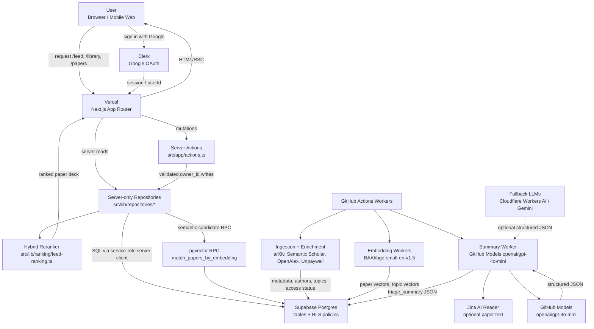
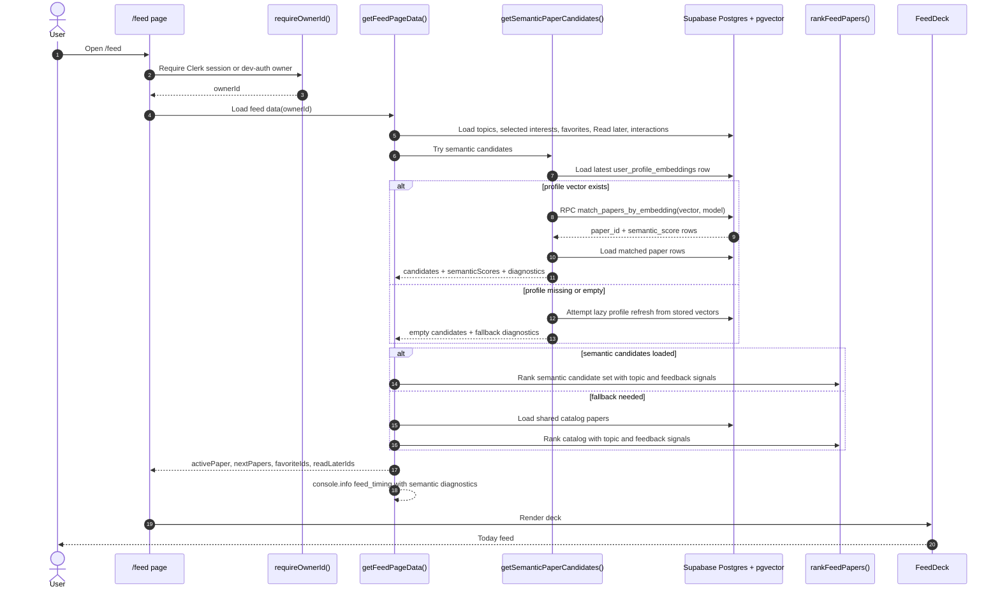
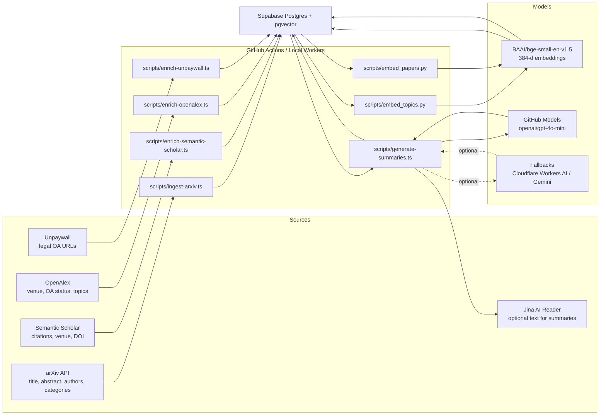
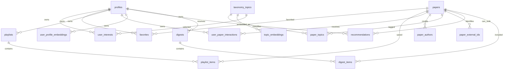
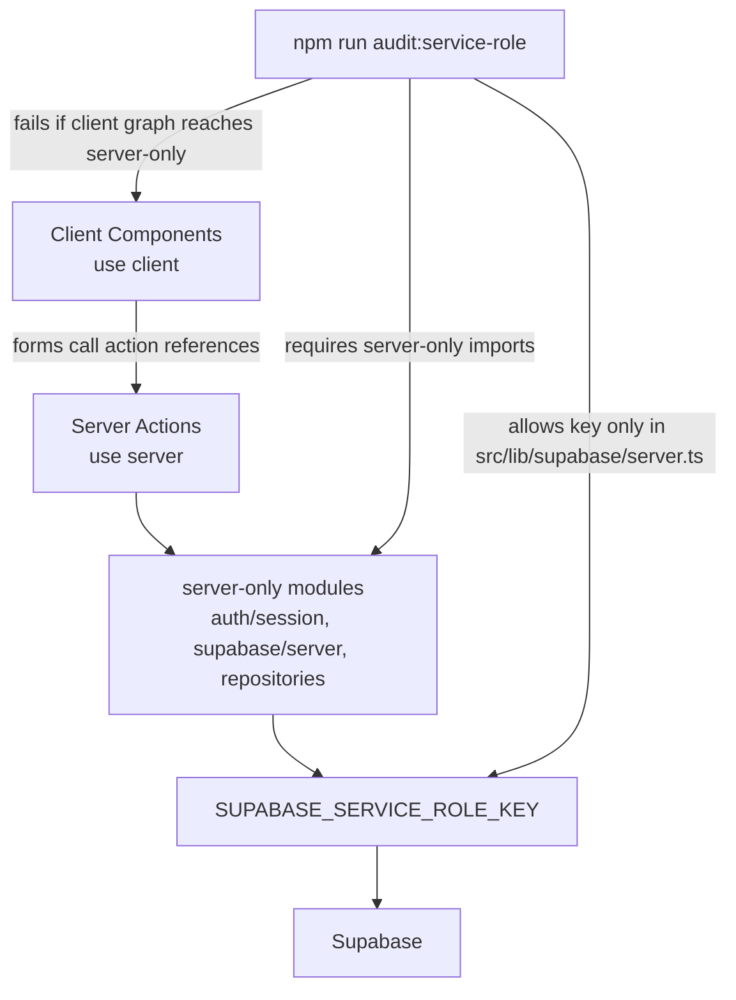
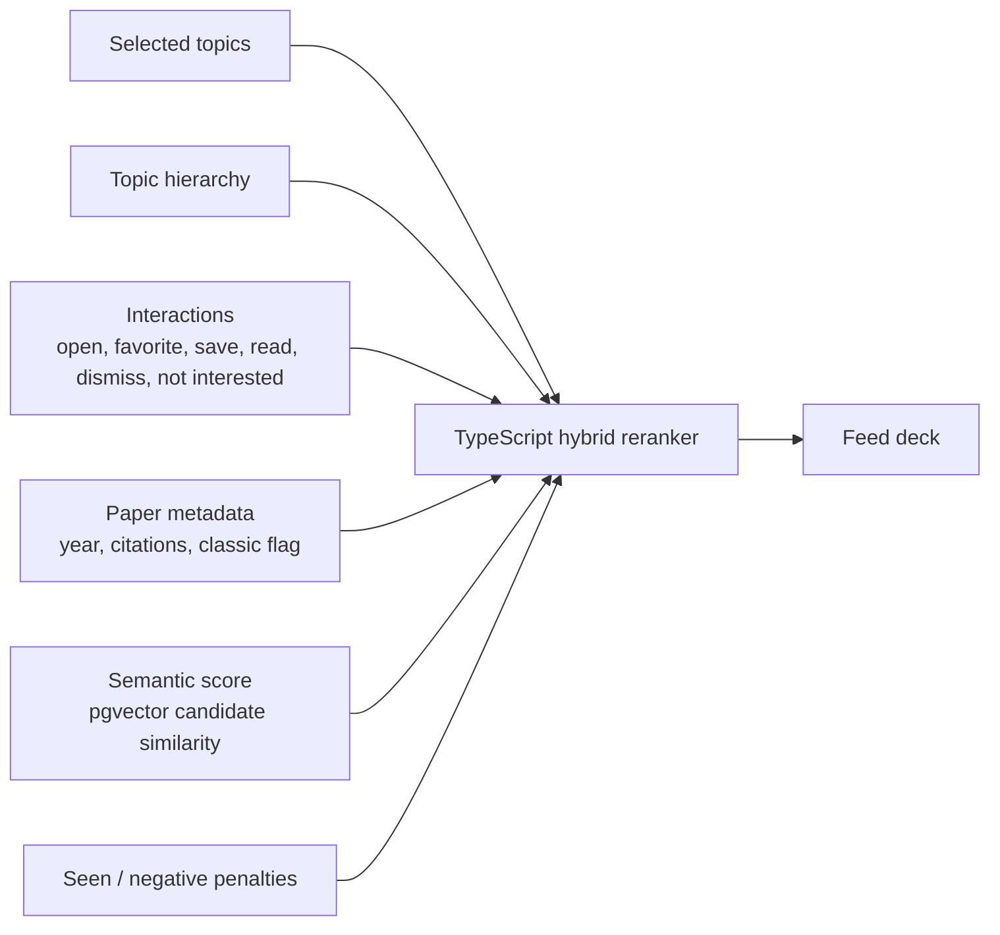

# Architecture

PaperDeck is a Next.js application backed by Clerk, Supabase Postgres, pgvector, and GitHub Actions workers. The runtime app stays lightweight: expensive ingestion, enrichment, embedding, and LLM summary work happens outside Vercel.

## Stack

| Layer | Technology | Role |
| --- | --- | --- |
| Web app | Next.js 16, React 19, TypeScript | App Router pages, server components, server actions, route handlers |
| UI | Tailwind CSS, lucide-react | Mobile-first feed, library, onboarding, settings, detail actions |
| Auth | Clerk, Google OAuth | User login, protected routes, `owner_id` source |
| Hosting | Vercel | Public app runtime and lightweight server code |
| Database | Supabase Postgres | Paper catalog, user state, ingestion cursors, summary JSON |
| Vector search | pgvector | Top-K paper retrieval with `match_papers_by_embedding` |
| Batch workers | GitHub Actions, local scripts | arXiv ingestion, metadata enrichment, embeddings, summaries |
| Embedding model | `BAAI/bge-small-en-v1.5` | 384-dimensional paper/topic vectors |
| Planned benchmark models | `intfloat/e5-small-v2`, `sentence-transformers/all-MiniLM-L6-v2` | Offline retrieval quality comparison |
| Summary model | GitHub Models `openai/gpt-4o-mini` | Structured paper triage summaries |
| Summary fallbacks | Cloudflare Workers AI, Gemini | Optional fallback providers |
| Full-text reader | Jina AI Reader | Optional source text extraction for summary generation |
| Tests/guardrails | ESLint, TypeScript, Playwright, service-role audit | Static and smoke validation |

## End-To-End System

## Runtime Feed Flow

## Batch Data Pipeline

## Data Model Map

## Security And Runtime Boundaries

## Ranking Inputs

## Operational Notes

- Vercel never loads embedding models or long-running workers.
- `SUPABASE_SERVICE_ROLE_KEY` is restricted to server-only code and batch workers.
- Client-visible keys must use the `NEXT_PUBLIC_` prefix only when they are intentionally public.
- The feed logs `feed_timing` JSON with nested semantic retrieval diagnostics for debugging.
- Playwright smoke tests cover core authenticated pages through local dev auth; Clerk redirect tests are opt-in.
