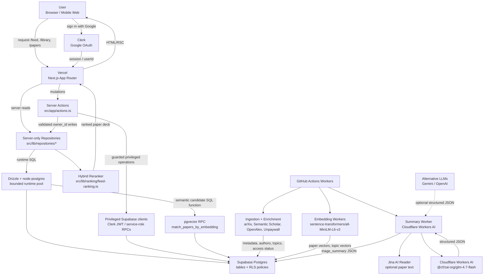
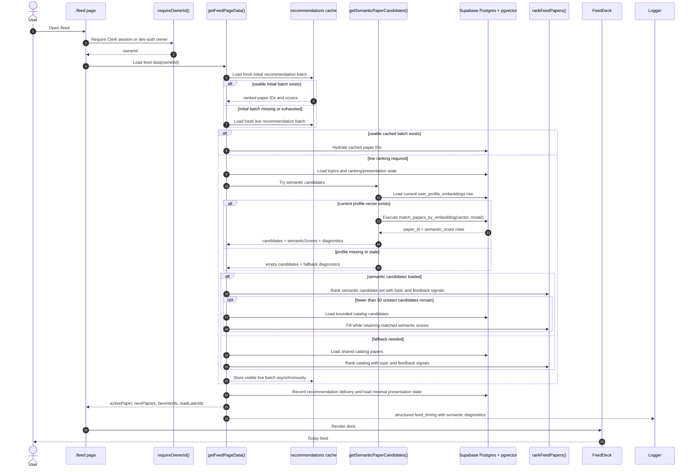
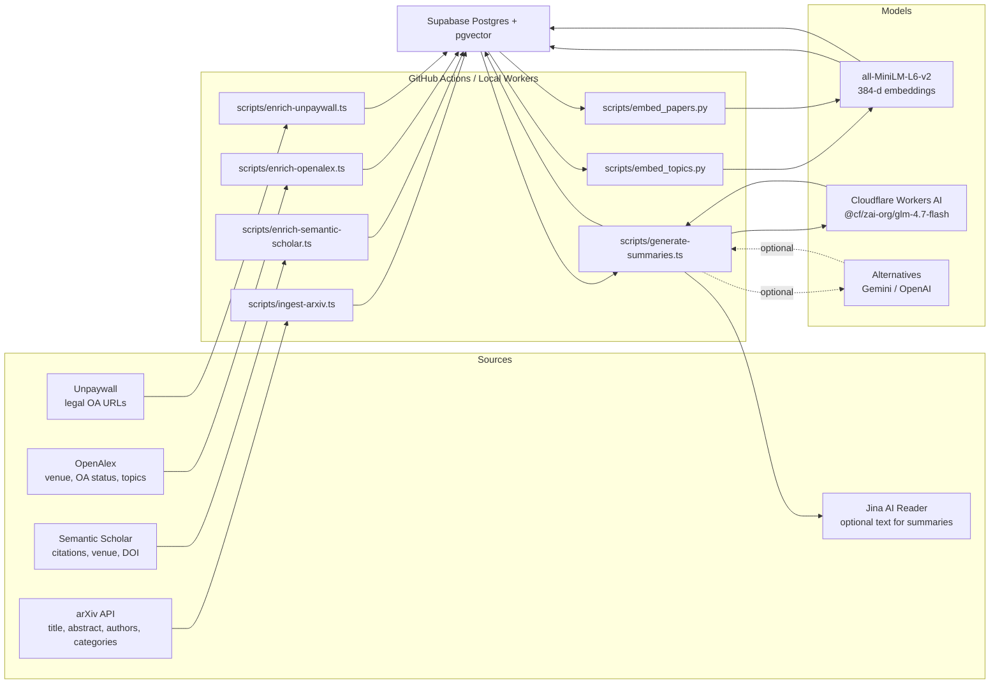
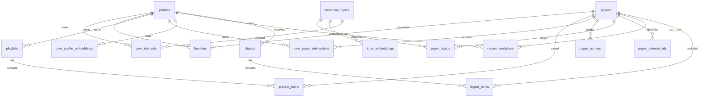
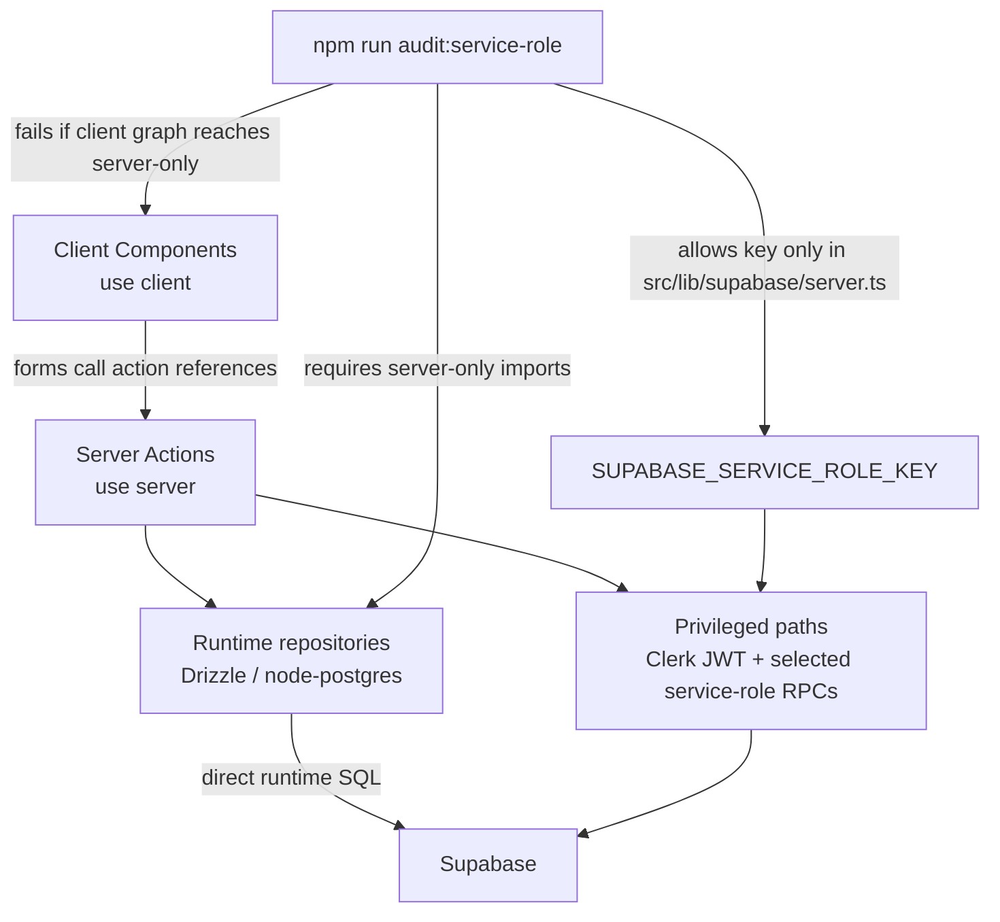
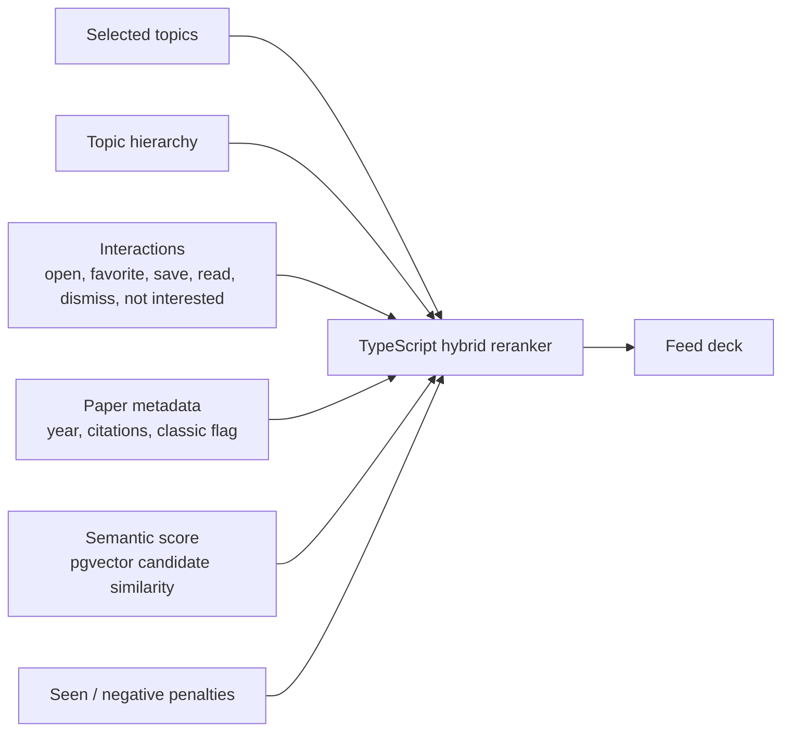

# Architecture

PaperDeck is a Next.js application backed by Clerk, Supabase Postgres, pgvector, and GitHub Actions workers. The runtime app stays lightweight: expensive ingestion, enrichment, embedding, and LLM summary work happens outside Vercel.

This document is the authoritative detailed description of the currently
deployed application architecture and feature boundaries. `PROJECT_STATE.md`
is the compact agent entry point, while `ROADMAP.md` records durable product
decisions and next steps. Historical session notes describe the state at the
time they were written and are not current-state specifications.

Last reconciled with deployed code: 2026-08-20.

## Stack

| Layer | Technology | Role |
| --- | --- | --- |
| Web app | Next.js 16, React 19, TypeScript | App Router pages, server components, server actions, route handlers |
| UI | Tailwind CSS, lucide-react | Mobile-first feed, library, onboarding, settings, detail actions |
| Auth | Clerk, Google OAuth | User login, protected routes, `owner_id` source |
| Hosting | Vercel | Public app runtime and lightweight server code |
| Database | Supabase Postgres | Paper catalog, user state, ingestion cursors, summary JSON |
| Vector search | pgvector | Top-K paper retrieval with `match_papers_by_embedding` |
| Batch workers | GitHub Actions, local scripts | arXiv ingestion, metadata enrichment, embeddings, summaries |
| Embedding model | `sentence-transformers/all-MiniLM-L6-v2` | 384-dimensional paper/topic vectors |
| Historical benchmark models | `BAAI/bge-small-en-v1.5`, `intfloat/e5-small-v2` | Offline retrieval quality comparison |
| Summary model | Cloudflare Workers AI `@cf/zai-org/glm-4.7-flash` | Scheduled structured paper triage summaries |
| Summary alternatives | Gemini, OpenAI | Manually selectable providers |
| Full-text reader | Jina AI Reader | Optional source text extraction for summary generation |
| Tests/guardrails | ESLint, TypeScript, Playwright, service-role audit | Static and smoke validation |

## End-To-End System

```mermaid
flowchart TB
  user["User<br/>Browser / Mobile Web"]
  vercel["Vercel<br/>Next.js App Router"]
  clerk["Clerk<br/>Google OAuth"]
  actions["Server Actions<br/>src/app/actions.ts"]
  repos["Server-only Repositories<br/>src/lib/repositories/*"]
  runtimeDb["Drizzle + node-postgres<br/>bounded runtime pool"]
  privileged["Privileged Supabase clients<br/>Clerk JWT / service-role RPCs"]
  ranking["Hybrid Reranker<br/>src/lib/ranking/feed-ranking.ts"]
  supabase["Supabase Postgres<br/>tables + RLS policies"]
  pgvector["pgvector RPC<br/>match_papers_by_embedding"]
  ghActions["GitHub Actions Workers"]
  ingestion["Ingestion + Enrichment<br/>arXiv, Semantic Scholar, OpenAlex, Unpaywall"]
  embeddings["Embedding Workers<br/>sentence-transformers/all-MiniLM-L6-v2"]
  summaries["Summary Worker<br/>Cloudflare Workers AI"]
  cloudflareModel["Cloudflare Workers AI<br/>@cf/zai-org/glm-4.7-flash"]
  alternativeModels["Alternative LLMs<br/>Gemini / OpenAI"]
  jina["Jina AI Reader<br/>optional paper text"]

  user -->|"request /feed, /library, /papers"| vercel
  user -->|"sign in with Google"| clerk
  clerk -->|"session / userId"| vercel
  vercel -->|"mutations"| actions
  vercel -->|"server reads"| repos
  actions -->|"validated owner_id writes"| repos
  repos -->|"runtime SQL"| runtimeDb
  runtimeDb --> supabase
  actions -->|"guarded privileged operations"| privileged
  privileged --> supabase
  runtimeDb -->|"semantic candidate SQL function"| pgvector
  pgvector --> supabase
  repos --> ranking
  ranking -->|"ranked paper deck"| vercel
  vercel -->|"HTML/RSC"| user

  ghActions --> ingestion
  ingestion -->|"metadata, authors, topics, access status"| supabase
  ghActions --> embeddings
  embeddings -->|"paper vectors, topic vectors"| supabase
  ghActions --> summaries
  summaries --> jina
  summaries --> cloudflareModel
  cloudflareModel -->|"structured JSON"| summaries
  alternativeModels -. optional structured JSON .-> summaries
  summaries -->|"triage_summary JSON"| supabase
```

## Runtime Feed Flow

```mermaid
sequenceDiagram
  autonumber
  actor User
  participant Page as /feed page
  participant Auth as requireOwnerId()
  participant Repo as getFeedPageData()
  participant Cache as recommendations cache
  participant Semantic as getSemanticPaperCandidates()
  participant Supabase as Supabase Postgres + pgvector
  participant Ranker as rankFeedPapers()
  participant UI as FeedDeck

  User->>Page: Open /feed
  Page->>Auth: Require Clerk session or dev-auth owner
  Auth-->>Page: ownerId
  Page->>Repo: Load feed data(ownerId)
  Repo->>Cache: Load fresh initial recommendation batch
  alt usable initial batch exists
    Cache-->>Repo: ranked paper IDs and scores
  else initial batch missing or exhausted
    Repo->>Cache: Load fresh live recommendation batch
  end
  alt usable cached batch exists
    Repo->>Supabase: Hydrate cached paper IDs
  else live ranking required
    Repo->>Supabase: Load topics and ranking/presentation state
    Repo->>Semantic: Try semantic candidates
    Semantic->>Supabase: Load current user_profile_embeddings row
    alt current profile vector exists
      Semantic->>Supabase: Execute match_papers_by_embedding(vector, model)
      Supabase-->>Semantic: paper_id + semantic_score rows
      Semantic-->>Repo: candidates + semanticScores + diagnostics
    else profile missing or stale
      Semantic-->>Repo: empty candidates + fallback diagnostics
    end
    alt semantic candidates loaded
      Repo->>Ranker: Rank semantic candidate set with topic and feedback signals
      opt fewer than 50 unseen candidates remain
        Repo->>Supabase: Load bounded catalog candidates
        Repo->>Ranker: Fill while retaining matched semantic scores
      end
    else fallback needed
      Repo->>Supabase: Load shared catalog papers
      Repo->>Ranker: Rank catalog with topic and feedback signals
    end
    Repo-->>Cache: Store visible live batch asynchronously
  end
  Repo->>Supabase: Record recommendation delivery and load minimal presentation state
  Repo-->>Page: activePaper, nextPapers, favoriteIds, readLaterIds
  Repo-->>Logger: structured feed_timing with semantic diagnostics
  Page->>UI: Render deck
  UI-->>User: Today feed
```

## Batch Data Pipeline

```mermaid
flowchart LR
  subgraph Sources
    arxiv["arXiv API<br/>title, abstract, authors, categories"]
    s2["Semantic Scholar<br/>citations, venue, DOI"]
    openalex["OpenAlex<br/>venue, OA status, topics"]
    unpaywall["Unpaywall<br/>legal OA URLs"]
    jina["Jina AI Reader<br/>optional text for summaries"]
  end

  subgraph Workers["GitHub Actions / Local Workers"]
    ingest["scripts/ingest-arxiv.ts"]
    enrichS2["scripts/enrich-semantic-scholar.ts"]
    enrichOpenAlex["scripts/enrich-openalex.ts"]
    enrichUnpaywall["scripts/enrich-unpaywall.ts"]
    embedTopics["scripts/embed_topics.py"]
    embedPapers["scripts/embed_papers.py"]
    summarize["scripts/generate-summaries.ts"]
  end

  subgraph Models
    minilm["all-MiniLM-L6-v2<br/>384-d embeddings"]
    cloudflareModel["Cloudflare Workers AI<br/>@cf/zai-org/glm-4.7-flash"]
    alternativeModels["Alternatives<br/>Gemini / OpenAI"]
  end

  db["Supabase Postgres + pgvector"]

  arxiv --> ingest --> db
  s2 --> enrichS2 --> db
  openalex --> enrichOpenAlex --> db
  unpaywall --> enrichUnpaywall --> db
  db --> embedTopics
  db --> embedPapers
  embedTopics --> minilm --> db
  embedPapers --> minilm --> db
  db --> summarize
  summarize --> jina
  summarize --> cloudflareModel
  summarize -. optional .-> alternativeModels
  cloudflareModel --> summarize
  alternativeModels -. optional .-> summarize
  summarize --> db
```

## Data Model Map

```mermaid
erDiagram
  profiles ||--o{ user_interests : owns
  profiles ||--o{ favorites : owns
  profiles ||--o{ playlists : owns
  profiles ||--o{ user_paper_interactions : owns
  profiles ||--o{ user_profile_embeddings : owns
  playlists ||--o{ playlist_items : contains
  papers ||--o{ favorites : favorited
  papers ||--o{ playlist_items : saved
  papers ||--o{ user_paper_interactions : receives
  papers ||--o{ paper_authors : credits
  papers ||--o{ paper_topics : tagged
  papers ||--o{ paper_external_ids : identifies
  taxonomy_topics ||--o{ paper_topics : classifies
  taxonomy_topics ||--o{ topic_embeddings : embedded_as
  taxonomy_topics ||--o{ user_interests : selected
  papers ||--o{ recommendations : can_rank
  profiles ||--o{ recommendations : receives
  profiles ||--o{ digests : owns
  digests ||--o{ digest_items : contains
  papers ||--o{ digest_items : included
```

## Security And Runtime Boundaries

```mermaid
flowchart TB
  client["Client Components<br/>use client"]
  serverActions["Server Actions<br/>use server"]
  repositories["Runtime repositories<br/>Drizzle / node-postgres"]
  privileged["Privileged paths<br/>Clerk JWT + selected service-role RPCs"]
  serviceRole["SUPABASE_SERVICE_ROLE_KEY"]
  audit["npm run audit:service-role"]
  supabase["Supabase"]

  client -->|"forms call action references"| serverActions
  serverActions --> repositories
  repositories -->|"direct runtime SQL"| supabase
  serverActions --> privileged
  serviceRole --> privileged
  privileged --> supabase
  audit -->|"fails if client graph reaches server-only"| client
  audit -->|"requires server-only imports"| repositories
  audit -->|"allows key only in src/lib/supabase/server.ts"| serviceRole
```

Normal application repositories use the bounded direct PostgreSQL pool from
`src/db/index.ts` and `src/db/runtime-pool.ts`, including invocation of the
pgvector matching SQL function. Supabase clients are separate, explicit paths:
Clerk-authenticated clients exercise RLS for selected collaboration operations,
while the service-role client is limited to privileged webhook and guarded RPC
work. The service-role key is never the general repository transport.

## Ranking Inputs

```mermaid
flowchart LR
  interests["Selected topics"]
  hierarchy["Topic hierarchy"]
  feedback["Interactions<br/>open, favorite, save, read, dismiss, not interested"]
  metadata["Paper metadata<br/>year, citations, classic flag"]
  semantic["Semantic score<br/>pgvector candidate similarity"]
  penalties["Seen / negative penalties"]
  ranker["TypeScript hybrid reranker"]
  deck["Feed deck"]

  interests --> ranker
  hierarchy --> ranker
  feedback --> ranker
  metadata --> ranker
  semantic --> ranker
  penalties --> ranker
  ranker --> deck
```

## Operational Notes

- Vercel never loads embedding models or long-running workers.
- `SUPABASE_SERVICE_ROLE_KEY` is restricted to server-only code and batch workers.
- Client-visible keys must use the `NEXT_PUBLIC_` prefix only when they are intentionally public.
- The server logger emits structured JSON events for feed timing, preload, onboarding personalization, and deck API failures.
- Playwright smoke tests cover core authenticated pages through local dev auth; Clerk redirect tests are opt-in.
