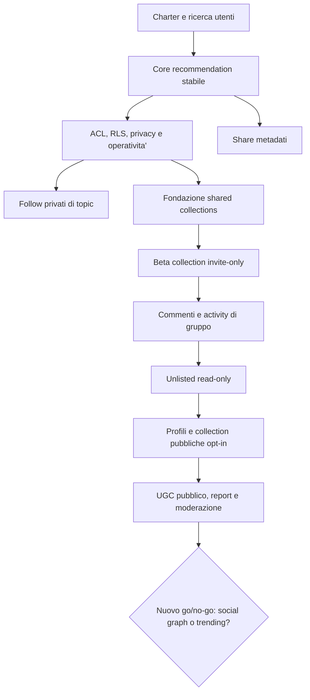

# Piano di sviluppo delle interazioni sociali

**Stato:** proposta di sviluppo, non ancora una decisione di rilascio  
**Ultimo aggiornamento:** 2026-07-15
**Origine:** [GitHub issue #37](https://github.com/Mik1810/PaperDeck/issues/37)

Questo documento trasforma la #37 da promemoria post-MVP in un programma concreto. Non autorizza a rendere pubblici dati esistenti: feed, ranking, preferiti, playlist e note restano privati finché ogni fase non supera il proprio gate.

## 1. Obiettivo di prodotto

PaperDeck resta un **daily CS triage deck**, non una rete sociale generalista. Le interazioni sociali devono aiutare piccoli gruppi di ricercatori a condividere e discutere una lista di paper, senza esporre il feed personale o creare un social graph pubblico.

Il percorso previsto e':

```text
condivisione di un paper
  -> follow privati di entita' accademiche
  -> shortlist condivise su invito
  -> discussione nel piccolo gruppo
  -> pubblicazione opt-in e moderata
  -> eventuale social graph, solo dopo una nuova decisione
```

La UX attuale e' gia' *social-like* (deck, swipe, cuore e bookmark), ma e' individuale. Questo piano riguarda dati o azioni tra persone, non una nuova animazione del feed.

### Livelli di esposizione

| Livello | Esempio | Dati esposti | Default |
| --- | --- | --- | --- |
| Privato | feed, preferiti, note, interessi | solo il proprietario | attivo oggi |
| Condivisione esterna | copia link/DOI di un paper | solo metadati pubblici del paper | primo slice |
| Invite-only | shortlist per un gruppo | collection e contributi dei membri | post-gate |
| Unlisted | raccolta read-only con URL-capability | contenuto scelto dall'owner | dopo il pilot |
| Pubblico opt-in | profilo minimale e raccolta pubblicata | solo campi esplicitamente pubblicati | dopo moderazione |
| Social graph/UGC pubblico | follow utenti, commenti, trending | contenuti e relazioni tra utenti | nuova decisione separata |

**Regola invariabile:** un'informazione privata non diventa condivisa o pubblica perche' e' tecnicamente disponibile. Deve esistere una scelta esplicita dell'utente, registrata e revocabile.

### Decisioni iniziali su gruppi e amicizie

- Il target iniziale sono piccoli gruppi di ricerca privati.
- Ogni gruppo contiene una sola lista condivisa di paper.
- I ruoli iniziali sono owner, admin e member; soltanto owner/admin possono invitare.
- Essere invitabile non equivale a essere aggiunto: ogni ingresso richiede accettazione esplicita.
- La policy inviti e' `nobody`, `friends_only` o `anyone`; il default proposto resta `friends_only`.
- La ricerca account usa soltanto l'email esatta ed e' abilitata di default (opt-out dalle impostazioni), senza autocomplete o ricerca parziale.
- L'amicizia e' reciproca dopo accettazione; un rifiuto impone 30 giorni di cooldown e il blocco impedisce nuove richieste e inviti.
- La #94 implementa richieste pending/accepted/declined/cancelled, richieste incrociate che accettano automaticamente, cancel senza cooldown, unfriend senza cooldown e unblock senza ripristino delle relazioni precedenti.
- Ogni account puo' creare al massimo 10 nuove richieste in 24 ore; richieste duplicate e tutte le transizioni sono idempotenti e serializzate per coppia.
- L'owner puo' scegliere un successore; altrimenti ownership passa all'admin attivo piu' anziano, poi al membro attivo piu' anziano. Senza altri membri il gruppo viene eliminato.
- Le amicizie autorizzano discovery e inviti: niente follower, conteggi, suggerimenti di persone o feed sociale nella prima fase.

### Decisioni iniziali sulle notifiche

- Campanella nell'header con badge fino a `99+`.
- Menu con gli ultimi 20 eventi, azioni inline `Accept`/`Decline` per richieste e inviti, e futura pagina di cronologia completa.
- Retention delle notifiche informative: 90 giorni; eliminare una notifica non modifica la richiesta o l'invito sorgente.
- Eventi iniziali: richieste di amicizia, inviti e membership gruppo, ruoli/ownership e paper aggiunti o rimossi dalla lista condivisa.
- Postgres conserva la notifica durevole; un canale realtime privato pubblica soltanto il segnale di aggiornamento e il client rilegge i dati autorizzati.
- La futura chat interattiva del gruppo, possibilmente collegata ai paper condivisi, e' un tema esplicito da progettare separatamente prima dell'implementazione.

## 2. Confini e non-goal

### Cosa costruiamo

- **Share:** inviare metadati e URL canonico di un paper a un canale esterno.
- **Follow accademico:** ricevere una vista privata dei paper relativi a topic e, in futuro, a venue o autori canonicalizzati.
- **Gruppo di ricerca:** membership privata con owner/admin/member e una lista condivisa di paper separata dalle playlist personali.
- **Discussione di gruppo:** rationale o commenti limitati ai membri di una collection.
- **Pubblicazione:** rendere visibile una collection selezionata, mai una libreria o un comportamento personale implicito.

### Cosa non costruiamo nel primo programma

- feed pubblico, trending, like-count o ranking basato sull'attivita' altrui;
- messaggi diretti, sincronizzazione contatti, import rubriche o suggerimenti di persone;
- condivisione automatica di `favorites`, `Read later`, interessi, impression, embedding, reason del ranking o note private;
- commenti anonimi, HTML/Markdown ricco, allegati o ripubblicazione di PDF;
- ricerca utenti parziale, directory pubblica o profilo pubblico implicito; resta ammessa soltanto la ricerca privata per email esatta secondo le impostazioni dell'utente.

Le ultime due categorie possono essere rivalutate solo con un nuovo go/no-go: non sono una conseguenza automatica della #37.

## 3. Prerequisiti obbligatori

Nessuna beta sociale esterna parte prima di questi gate. Il prototipo client-side di Share puo' essere preparato in parallelo, ma viene rilasciato solo quando il gate di prodotto e' approvato.

### A — Charter e ricerca utenti

**Da fare prima del codice sociale persistente:**

1. Approvare questo target: collaborazione per piccoli gruppi di ricerca, non social network.
2. Per ogni fase dichiarare audience, dati mostrati, owner, revoca, retention, export, delete e comportamento dopo chiusura account.
3. Definire un responsabile operativo per privacy, abuse report e incidenti.
4. Fare 5–8 prove/interviste con ricercatori o piccoli lab per validare il bisogno di condividere una shortlist.
5. Tenere #37 come epic; creare issue figlie solo dopo l'approvazione del perimetro di ciascuna fase.

**Gate di uscita:** decision record approvato, audience iniziale scelta e non-goal pubblicati nel backlog.

### B — Core recommendation stabile

Le interazioni sociali non devono mascherare un ranking non misurabile. Prima vanno chiuse le issue gia' aperte:

| Dipendenza | Perche' blocca il programma |
| --- | --- |
| [#81](https://github.com/Mik1810/PaperDeck/issues/81) | ✅ Risolta il 2026-07-10: le azioni del deck mantengono l'attribuzione all'impressione mostrata. |
| [#83](https://github.com/Mik1810/PaperDeck/issues/83) | ✅ Risolta il 2026-07-10: `already_read` allena coerentemente pesi e profilo semantico. |
| [#84](https://github.com/Mik1810/PaperDeck/issues/84) | ✅ Risolta il 2026-07-11: gli interessi usano un salvataggio esplicito, seriale e con rollback allo stato confermato. |
| [#82](https://github.com/Mik1810/PaperDeck/issues/82) | ✅ Risolta il 2026-07-11: i link autenticati disabilitano il prefetch per proteggere il budget di latenza mobile. |

In aggiunta:

- fissare una baseline/versione del ranker e un piccolo protocollo di valutazione ripetibile;
- allineare la documentazione sul percorso semantico realmente attivo;
- definire metriche di qualita', copertura, ripetizione e latenza per la parola "stabile";
- vietare che share, membership, commenti o attivita' sociale scrivano in `user_paper_interactions`, nei pesi del profilo o nel ranking senza un esperimento esplicito, opt-in e misurato.

**Gate di uscita:** #81, #83, #84 e #82 chiuse; azioni attribuite; metriche osservabili; nessuna regressione di privacy o performance sul feed.

### C — Autorizzazione, privacy e operativita'

Oggi i dati user-scoped passano dal server con controlli di ownership applicativi; il normale percorso MVP Drizzle/service-role non applica RLS. Questo e' adatto ai dati single-owner, ma non basta per condividere righe tra utenti.

Prima di una beta invite-only:

1. Creare un evaluator centrale, ad esempio `requireCollectionPermission(actorOwnerId, collectionId, role)`. Ogni read e write deve chiamarlo; conoscere un UUID non concede accesso.
2. Attivare e testare Clerk JWT + RLS almeno per le nuove tabelle cross-user; il controllo server-side resta una seconda difesa.
3. Aggiungere una matrice di route: pubblico, autenticato, invito, amministrativo. Le route nuove non diventano accessibili per omissione dal proxy.
4. Introdurre feature flag e kill switch per share, inviti, pubblicazione e commenti. Il rollback deve poter revocare inviti e rimettere le collection in stato privato.
5. Passare a logger con allowlist/redaction: mai loggare email, token invito, URL unlisted, body utente o identificatori sensibili non necessari.
6. Conservare la strategia PWA *network-only* per route autenticate e invite-only; una collection revocata non deve ricomparire dalla cache.

**Gate di uscita:** test negativi ACL/RLS superati, kill switch provato, log redatti e runbook per revoca/incidenti disponibile.

## 4. Architettura target

### Tre domini di dati

| Dominio | Esempi | Regola |
| --- | --- | --- |
| Catalogo | paper, autori, topic, DOI, URL | dati condivisi del catalogo, soggetti alle licenze delle fonti |
| Privato utente | feed, impression, interessi, favorite, `Read later`, note, embedding | mai leggibile da altri utenti |
| Collaborazione | collection, membership, inviti, item condivisi, attivita' | accessibile soltanto secondo un ACL esplicito |

Non estendere silenziosamente le attuali `playlists` private. Sono owner-only nel modello e nelle policy; aggiungere una sola colonna `visibility` rischia di esporre playlist, note o semantiche private. La prima collaborazione usa un dominio separato `shared_collections`, riusando soltanto i pattern UI e di ordinamento gia' affidabili.

### Identita' collaborative e pubbliche

- La fondazione invite-only e' implementata dalla #93: il nome pubblico viene scelto esplicitamente come primo passo dell'onboarding, e non deriva mai dall'email Clerk.
- `collaboration_identities` conserva un UUID pubblico, le preferenze di discovery/invito e soltanto l'HMAC dell'email primaria verificata. Email e Clerk ID non vengono restituiti dalla ricerca.
- La ricerca e' solo per email esatta, usa POST/server action, applica 10 tentativi al minuto e rende profilo inesistente e profilo non trovabile indistinguibili.
- Il default e' discovery email attiva (opt-out) e inviti da `friends_only`; un webhook Clerk firmato sincronizza cambio/rimozione dell'email primaria.
- Nessun interesse, cronologia, libreria o altro dato privato entra nel profilo collaborativo.
- `friend_requests`, `friendships` e `user_blocks` tengono separati lifecycle, relazione reciproca e blocco direzionale. Un blocco rimuove amicizia/richieste e rende la discovery indisponibile in entrambe le direzioni.
- Per il pubblico creare piu' tardi `public_profiles`, opt-in e separato, con handle normalizzato e display name scelto. Un profilo pubblico nasce disattivato e non indicizzato.

### Ruoli

| Ruolo | Legge collection | Modifica item | Gestisce membri/inviti | Cancella o pubblica |
| --- | --- | --- | --- | --- |
| Owner | si | si | si | si |
| Editor | si | si | no | no |
| Viewer | si | no | no | no |
| Outsider/revocato | no, risposta indistinguibile da non trovato | no | no | no |

Un viewer puo' copiare un paper nella **propria** libreria con un'azione esplicita; questa copia non divulga il suo comportamento ne' influenza il ranking degli altri membri.

### Schema futuro, per fasi

| Fase | Nuove tabelle/campi | Dettagli essenziali |
| --- | --- | --- |
| Share | nessuno | tutto client-side, nessuna analytics persistita |
| Follow privati | `topic_subscriptions` | `(owner_id, topic_id)` come chiave; non riusare `user_interests` |
| Collaboration | `collaboration_identities`, `shared_collections`, `shared_collection_members`, `shared_collection_invites`, `shared_collection_items`, `shared_collection_activity` | UUID pubblico, discovery HMAC, ACL, ruoli, token hashati, revision e audit minimale |
| Discussione | `shared_collection_comments`, `content_reports`, `user_blocks` | plain text, limiti, stati di moderazione |
| Pubblico | `public_profiles`, `public_collection_publications`, `privacy_consents` | consenso/versione, handle e pubblicazione selettiva |
| Operativita' | `moderation_cases`, `moderation_actions`, `security_audit_events`, `export_jobs`, `deletion_jobs` | lifecycle, audit, export e delete verificabili |

Ogni tabella richiede migration versionata, aggiornamento di `supabase/schema.sql`, schema Drizzle/relazioni, repository `server-only`, tag `@user-scoped` o `@admin`, indici, policy RLS, documentazione database e test di isolamento.

## 5. Roadmap dalla A alla Z



### D — Share di un paper

**User story:** dal dettaglio di un paper, l'utente invia a una collega titolo, autori e link canonico senza condividere il proprio utilizzo di PaperDeck.

**Implementazione:**

1. Creare `src/lib/client/paper-share.ts`, funzione pura che costruisce `title`, testo e URL dal paper.
2. Passare titolo/autori/anno/venue e `paper.url` a un pulsante Share in `PaperDetailActions`.
3. Usare `navigator.share()` in risposta al click utente; fare fallback su Clipboard API con messaggio accessibile.
4. Condividere l'URL esterno canonico (arXiv, DOI o landing page), **non** `/papers/[id]`, che richiede autenticazione.
5. Non creare endpoint, migration, follower, pagina pubblica, analytics di share o segnale di ranking in questa fase.

**Test e rollout:** unit test per payload, Web Share, clipboard e fallimenti; Playwright mobile/desktop; prova manuale iOS/Android; feature flag per alpha interna; monitorare soltanto errori tecnici aggregati e redatti. Il rollback e' la disabilitazione del flag, senza dati da migrare.

**Gate di uscita:** il destinatario riceve un link funzionante senza login a PaperDeck; nessun dato privato compare nel payload o nei log.

### E — Follow privati di topic, poi di entita' accademiche

Questo non e' ancora un follow tra persone. Serve a dire "voglio tenere sotto controllo questi topic" senza cambiare silenziosamente gli interessi che determinano il ranking.

**Primo scope:**

- aggiungere `topic_subscriptions(owner_id, topic_id, created_at, in_app_enabled)` con policy owner-only;
- repository e azioni server-side idempotenti;
- sezione privata in Library/Settings o filtro del digest in-app;
- nessun boost automatico al ranking e nessuna notifica email/push.

**Prerequisito per autore/venue:** autori e venue sono oggi nomi/testo libero. Prima di permettere un follow serve una canonicalizzazione con ID esterni e deduplicazione: non seguire stringhe ambigue o omonimi.

**Test:** isolamento owner, doppio toggle idempotente, topic inesistente, assenza di impatto sul ranking, export/delete.

**Gate di uscita:** il follow e' un'intenzione privata chiaramente distinguibile dagli interessi di personalizzazione.

### F — Fondazione delle collection condivise

Prima della UI multiutente creare il dominio collaborativo e la sua ACL.

**Migration proposta:**

- `shared_collections`: `id`, `owner_id`, `title`, `description` plain text, `state` (`invite_only`, poi `unlisted`/`public`), `revision`, timestamp e lifecycle;
- `shared_collection_members`: collection, membro, ruolo, invitante, join e revoca; indici per collection e membro attivo;
- `shared_collection_invites`: ruolo richiesto, digest HMAC/SHA-256 di token casuale, scadenza, singolo uso, creatore, accettazione e revoca. Il token raw non entra mai nel database, nei log o nelle analytics;
- `shared_collection_items`: collection, paper, posizione, `added_by`, data;
- `shared_collection_activity`: eventi append-only minimi (invito, join, aggiunta, rimozione, riordino, revoca), senza copiare note private o body di commenti.

**API e autorizzazione:**

- `requireCollectionPermission(actorOwnerId, collectionId, minimumRole)` e helper di query che non restituiscono dati prima dell'autorizzazione;
- owner crea/revoca inviti, cambia ruoli, rimuove membri e cancella collection;
- editor aggiunge/rimuove/riordina paper e poi commenta;
- viewer legge e copia un paper nella propria libreria;
- inviti tramite link copiato e consegnato esternamente: non introdurre provider email o import contatti;
- l'accettazione e' una `POST` autenticata e transazionale; landing e hand-off di login sono `no-store` con `Referrer-Policy: no-referrer`;
- UUID o URL non rappresentano autorizzazione: una risorsa non accessibile risponde come non trovata.

**Concorrenza e rollback:** lock transazionali su collection/invito/membership; `revision`/expected revision per il riordino; conflitto `409` con dati freschi, non last-write-wins; kill switch che blocca nuovi inviti e revoca accessi; nessuna migrazione automatica di playlist esistenti, soprattutto `Read later`.

**Gate di uscita:** ACL centrale, RLS delle nuove tabelle e test cross-user superati prima di mostrare una collection a un utente esterno all'owner.

### G — Beta di collection invite-only

**Esperienza utente:**

1. L'owner crea una nuova "Shared collection", non converte una playlist privata.
2. Imposta titolo e descrizione; sceglie viewer o editor.
3. Copia un invite link a uso singolo, con scadenza e revoca.
4. Il destinatario effettua login, accetta esplicitamente e vede la collection.
5. Owner/editor aggiungono, rimuovono e riordinano paper; viewer puo' soltanto leggere e copiare un paper nella propria libreria.
6. L'owner vede membri, ruoli e attivita' essenziale; puo' revocare un membro con effetto immediato.

**Matrice di test minima:**

| Caso | Risultato atteso |
| --- | --- |
| Owner | legge e amministra tutto |
| Editor | modifica item ma non ruoli o inviti |
| Viewer | legge ma non modifica |
| Outsider | non scopre ne' legge la collection |
| Invito scaduto/revocato | non crea membership |
| Membro revocato | perde subito read/write e cache non mostra contenuti |
| Riordino concorrente | conflitto esplicito, nessuna perdita silenziosa |
| Default `Read later` | non e' condivisibile |

**Rollout:** alpha interna con allowlist e cap di membri/collection, poi beta con pochi gruppi di ricerca. Prima di allargare il pilot verificare creazione, accettazione, revoche, denial autorizzativi e feedback qualitativo; non registrare analytics di lettura dei singoli membri.

**Gate di uscita:** gruppi pilota completano create → invite → add paper → revoke senza supporto; nessun leak cross-user, incidente di cache o regressione mobile.

### H — Discussione e attivita' nel gruppo

Solo dopo un pilot sano, aggiungere discussione limitata alla collection.

- `shared_collection_comments` separata da `paper_notes`;
- commento plain text, lunghezza limitata, opzionalmente legato a un paper;
- autore modifica/elimina il proprio contenuto; owner puo' nascondere o rimuovere contenuto nel proprio gruppo;
- activity log e inbox in-app; niente email/push, mention, thread profondi, allegati o HTML nella prima iterazione;
- rate limit, validazione server-side, escaping sicuro e stato lifecycle (`active`, `hidden`, `deleted`).

**Trust minimo gia' in beta:** blocco utente, report di contenuto, audit delle azioni owner/admin e percorso di rimozione. Il fatto che una collection sia invite-only non elimina il bisogno di interrompere abuso o accesso.

**Gate di uscita:** owner e utente possono rimuovere/bloccare/reportare; i test coprono XSS, limiti, revoca e autorizzazione autore/editor/owner/bloccato.

### I — Collection unlisted read-only

Una collection unlisted e' una pubblicazione limitata, **non** una collection privata. Chi possiede il link puo' leggerla; il link e' una capability e deve essere revocabile.

- solo owner sceglie di pubblicare una copia/snapshot selezionato;
- mostra soltanto titolo, descrizione, metadati del catalogo e item scelti;
- mai membri, activity, note private, favorite, segnali di ranking o profilo;
- URL opaco, token hashato, cache controllata, no-index iniziale e revoca immediata;
- landing pubblica separata dalle route autenticate e testata per assenza di identificatori privati.

**Gate di uscita:** audit di cache/CDN, revoke/unpublish, enumeration e test della risposta anonima superati.

### J — Profili pubblici e collection pubbliche opt-in

Questa fase parte solo se il pilot mostra domanda reale di curation pubblica e se moderazione e operativita' sono pronte.

- `public_profiles` separato da `profiles`, con handle, display name scelto, bio corta opzionale, visibilita' e consenso versione/timestamp;
- preview obbligatoria; profilazione e discoverability spente di default;
- una collection pubblica e' scelta manualmente dall'owner e mostra una whitelist di metadati; non eredita la libreria privata;
- unpublish/revoke immediato, export e delete verificabili;
- nessun crawl/indexing fino a scelta esplicita e verifica dei meta tag.

**Gate di uscita:** un test anonimo non ottiene email, owner ID, interest, impression, note, membership o recommendation reason; block/report/moderazione sono gia' operativi.

### K — UGC pubblico, reazioni e social graph

Commenti pubblici, reazioni, follow tra persone e discovery sociale vengono valutati soltanto dopo il pubblico read-only. Non si implementano insieme a profili o collection pubbliche.

**Prerequisiti aggiuntivi:**

- `content_reports`, `user_blocks`, `moderation_cases`, `moderation_actions` e ruoli amministrativi;
- code di review, stati `pending`/`hidden`/`removed`, audit e processo di appeal; responsabile e tempi operativi dichiarati;
- rate limit per account/IP/azione, protezione spam, nessuna scrittura anonima;
- rendering plain text sanitizzato, limiti di dimensione e divieto iniziale di embed/link arbitrari;
- retention esplicita per contenuti rimossi, report, audit e blocchi.

**Gate di uscita:** closed beta, reporting e blocco funzionano; il team puo' gestire la coda di moderazione prima di rendere il contenuto pubblicabile da tutti.

### L — Social feed, trending e ranking sociale: nuovo go/no-go

Non esiste un impegno a costruire questa fase. Qualunque feed pubblico, trending, follower graph o influenza sociale sul ranking richiede una nuova decisione con prova che migliora il triage, consenso esplicito, spiegabilita', opt-out, protezioni contro spam/brigading e metriche di equita'/qualita'.

Fino ad allora il ranking resta personale e usa soltanto segnali privati espliciti dell'utente.

## 6. Privacy, retention, export e delete

Prima di qualsiasi dato cross-user, completare questa matrice per ogni tabella e renderla parte della documentazione di prodotto.

| Classe | Audience | Esempi | Regole |
| --- | --- | --- | --- |
| Sensibile privata | solo owner | impression, ranking, interessi, embedding, note | non condividere, non pubblicare, non usare per suggerire persone |
| Collaborativa | membri autorizzati | collection, item, commenti, activity | ACL, revoca, audit, retention dichiarata |
| Capability/unlisted | possessore del link | snapshot scelto dall'owner | non e' privata, token revocabile, no cache indebita |
| Pubblica opt-in | chiunque | handle e collection scelta | preview, unpublish, report/block/moderazione |
| Operativa | operatori autorizzati | audit, report, rate-limit, delete job | accesso ristretto, retention minima necessaria |

Lifecycle richiesto:

- inviti scadono, sono monouso e revocabili;
- revoca membership prende effetto immediatamente per read e write;
- chiudere un account revoca inviti, sessioni/capability e accessi; il destino dei contributi condivisi deve essere dichiarato;
- export self-service include solo dati e azioni dell'utente, non note/report privati altrui;
- purge schedulato, idempotente e misurato per token scaduti, activity, contenuti rimossi, audit e job terminati;
- i log non conservano token, email o body UGC.

## 7. Piano di test e sicurezza

### Per ogni change set

1. Migration versionata e test su database vuoto/upgrade.
2. Aggiornamento coerente di schema SQL, Drizzle, relazioni e repository.
3. `npm run audit:service-role`, lint, typecheck, unit test e build.
4. E2E database-backed con owner, editor, viewer e outsider.
5. Test RLS negativo con Clerk JWT per nuove tabelle.
6. Verifica PWA/cache, logout/login su device condiviso e route private.
7. Test di accessibilita', mobile viewport, rollback e messaggi di errore.

### Scenari che non possono mancare

- token valido, scaduto, usato, revocato e manipolato;
- tentativi cross-user di lettura, modifica, reorder, delete e accept;
- cambio ruolo e revoca durante una sessione attiva;
- richieste duplicate/idempotenza e reorder concorrenti;
- XSS, contenuto oltre limite, report duplicato e utente bloccato;
- unpublish/revoke e nessuna risposta dalla cache dopo l'azione;
- account delete/export senza esfiltrare contenuti di altri membri;
- assenza di dati sociali nel payload del ranking e nei log.

## 8. Osservabilita', metriche e rollout

Le metriche sono aggregate, minimizzate e separate dalla telemetria del ranking. Non usare click, letture o commenti di un membro per migliorare il feed di un altro.

| Fase | Metriche ammesse | Segnali di stop |
| --- | --- | --- |
| Share | successo/fallimento tecnico redatto | errori browser o leak di payload |
| Follow | attivazione/disattivazione aggregata | confusione con interessi o regressione ranking |
| Collection | invite accept, collection attive, revoche, denial ACL | leak, inviti abusati, conflitti reorder |
| Discussione | commenti/report/blocchi aggregati, backlog moderazione | abuso non gestibile o risposta lenta |
| Pubblico | publish/unpublish, report, blocchi, cache revoke | doxxing, spam, enumerazione, incidenti privacy |

Ordine di rollout:

1. feature flag interno;
2. alpha con account controllati e kill switch provato;
3. pilot invite-only con piccoli gruppi;
4. retrospettiva su sicurezza, UX, costi operativi e domanda;
5. beta estesa solo dopo go/no-go scritto;
6. pubblico read-only e UGC seguono ciascuno un rollout autonomo.

## 9. Backlog figlio suggerito per #37

Queste issue non vengono create automaticamente con questo documento. Dopo approvazione del piano, l'ordine proposto e':

1. Chiudere #81, #83, #84 e #82.
2. `Social interaction charter: audience, privacy matrix and threat model`.
3. `Share a paper metadata and canonical external link`.
4. `Private topic subscriptions without ranking side effects`.
5. `Collaboration ACL and Clerk JWT/RLS gate for shared collections`.
6. `Shared collections schema, invitations and cross-user authorization tests`.
7. `Invite-only shared collection UI and pilot rollout`.
8. `Shared comments, activity and in-app inbox`.
9. `Unlisted read-only collection publishing and revoke/cache tests`.
10. `Public profile and selected collection publishing readiness`.
11. `Moderation, report, block and public UGC readiness`.
12. `Decision: whether to pursue social graph/trending at all`.

## 10. Definition of done

Una fase non e' completata perche' una schermata funziona. E' completata solo quando:

- scope, audience e non-goal sono documentati;
- dati, ruoli, inviti e lifecycle hanno policy e test negativi;
- privacy, revoca, export/delete e cache sono verificati;
- il comportamento mobile e accessibile e non rallenta il triage;
- logging/analytics sono minimizzati e redatti;
- rollout, kill switch, metriche e responsabile operativo esistono;
- documentazione, changelog, sessione e issue GitHub sono aggiornati con evidenza di test reale.

La #37 puo' essere chiusa soltanto quando viene trasformata in una decisione epic conclusa con issue figlie, oppure quando il suo titolo viene ristretto a uno slice preciso e quello slice e' effettivamente consegnato. Non va chiusa semplicemente dopo aver aggiunto un'icona Share.
